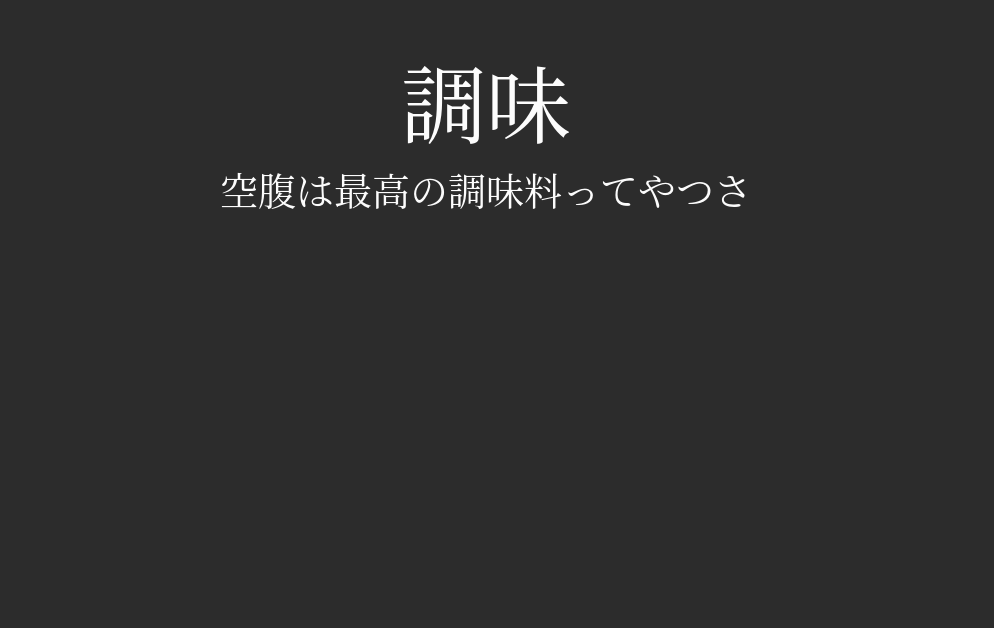
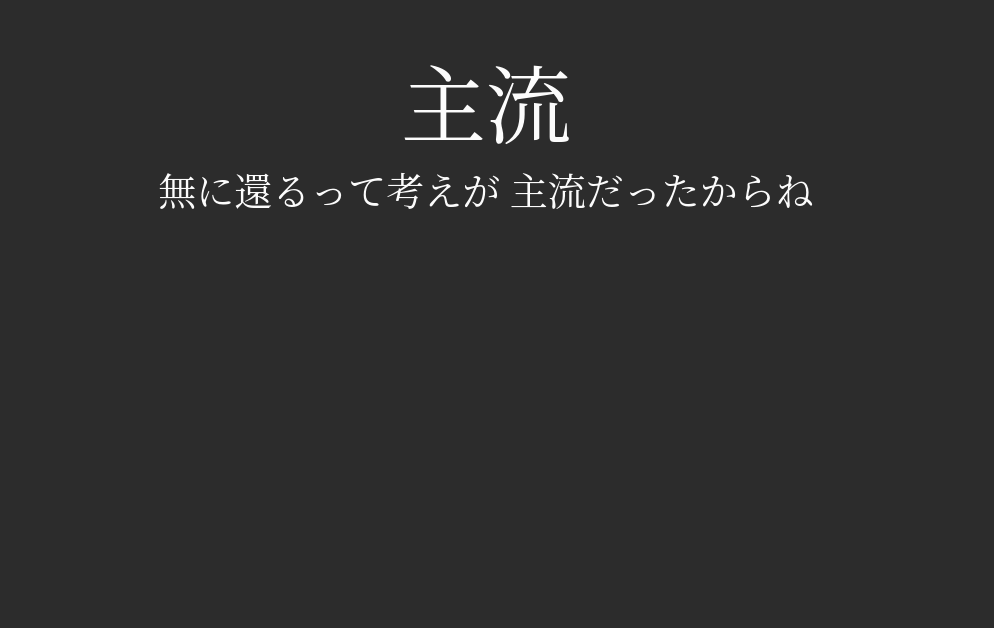

# Anki Miner

[](https://pypi.org/project/anki-miner/)
[](https://www.gnu.org/licenses/gpl-3.0)
[](https://www.python.org/downloads/)

Automated Japanese vocabulary mining from anime subtitles. Extracts unknown words, fetches definitions, pulls screenshots and audio from video files, and creates Anki flashcards automatically.

## Showcase

### App Showcase


### Cards Created with Anki Miner
| | | |
|---|---|---|
|  |  |  |

## How It Works

1. **Parse subtitles** — Tokenizes Japanese text using MeCab morphological analysis
2. **Filter words** — Keeps content words (nouns, verbs, adjectives, adverbs) and removes words already in your Anki collection
3. **Extract media** — Captures screenshots and audio clips from the video at each subtitle's timestamp using ffmpeg
4. **Fetch definitions** — Looks up English definitions from JMdict (offline) or the Jisho API
5. **Create cards** — Batch uploads everything to Anki via AnkiConnect

## Features

- **CLI and GUI** — Use from the terminal or through a desktop application
- **Batch processing** — Process entire anime series at once with automatic video/subtitle file pairing
- **Offline dictionary** — Fast JMdict lookups with Jisho API fallback
- **Parallel media extraction** — Concurrent ffmpeg processes for speed
- **Preview mode** — See what words would be mined without creating any cards
- **Smart filtering** — Skips particles, pronouns, onomatopoeia, sound effects, and words you already know
- **Theming** — Light, Dark, and Japanese-inspired GUI themes

## Installation

### Requirements

- **Python 3.10+** — [download](https://www.python.org/downloads/)
- **ffmpeg** — must be on your PATH
  - macOS: `brew install ffmpeg`
  - Ubuntu/Debian: `sudo apt install ffmpeg`
  - Windows: [download from ffmpeg.org](https://ffmpeg.org/download.html) and add to PATH
- **Anki** with [AnkiConnect](https://ankiweb.net/shared/info/2055492159) installed
  - In Anki, go to **Tools > Add-ons > Get Add-ons** and paste code `2055492159`
  - Restart Anki — AnkiConnect runs in the background while Anki is open

### Install Anki Miner

Install with [pipx](https://pipx.pypa.io/) (recommended, creates an isolated environment):

```bash
pipx install anki-miner
```

> **Don't have pipx?** Install it first: `pip install pipx && pipx ensurepath`, then restart your terminal.

Or install with pip directly:

```bash
pip install anki-miner
```

<details>
<summary><strong>Download standalone executable (no Python required)</strong></summary>

Download the latest release for your platform:

| Platform | Download |
|----------|----------|
| Windows  | [AnkiMiner-Windows-x86_64.zip](https://github.com/0xzerolight/anki_miner/releases/latest) |
| macOS    | [AnkiMiner-macOS-arm64.tar.gz](https://github.com/0xzerolight/anki_miner/releases/latest) |
| Linux    | [AnkiMiner-Linux-x86_64.tar.gz](https://github.com/0xzerolight/anki_miner/releases/latest) |

> **Note:** You still need [ffmpeg](https://ffmpeg.org/download.html) installed and
> [Anki](https://apps.ankiweb.net/) running with the
> [AnkiConnect](https://ankiweb.net/shared/info/2055492159) add-on.

</details>

<details>
<summary><strong>Manual installation (from source)</strong></summary>

```bash
git clone https://github.com/0xzerolight/anki_miner.git
cd anki_miner
python -m venv venv
source venv/bin/activate  # Linux/macOS
# or: venv\Scripts\activate  # Windows
pip install .
```

</details>

### Create Desktop Shortcut (Optional)

Create a clickable shortcut to launch Anki Miner from your desktop or app menu:

```bash
anki_miner create-shortcut
```

- **Linux**: Adds "Anki Miner" to your application menu
- **Windows**: Creates an "Anki Miner" shortcut on your Desktop and Start Menu

### Recommended Setup

These steps are optional but improve the experience.

#### Lapis Note Type

Anki Miner uses the [Lapis](https://github.com/donkuri/lapis) note type fields by default (an open-source Anki note type for Japanese learning).

1. Download the latest `.apkg` from [Lapis releases](https://github.com/donkuri/lapis/releases)
2. In Anki, go to **File > Import** and select the `.apkg` file

The default field mapping:

| Anki Miner Field | Note Field     | Content                     |
|------------------|----------------|-----------------------------|
| word             | Expression     | Dictionary form of the word |
| sentence         | Sentence       | Original subtitle line      |
| definition       | MainDefinition | English definitions         |
| picture          | Picture        | Screenshot from the video   |
| audio            | SentenceAudio  | Audio clip of the sentence  |

You can use a different note type by changing the field mappings in the GUI settings.
As long as the note type contains all the 'Anki Miner' fields, it should work well with the app.

#### JMdict Offline Dictionary

For fast offline lookups, download JMdict:

```bash
mkdir -p ~/.anki_miner
wget -O ~/.anki_miner/JMdict_e.gz http://ftp.edrdg.org/pub/Nihongo/JMdict_e.gz
gunzip ~/.anki_miner/JMdict_e.gz
```

Without JMdict, Anki Miner falls back to the Jisho API (slower, requires internet, rate-limited).

## Quick Start

### CLI

```bash
# Mine a single episode
anki_miner mine video.mkv subs.ass

# Preview words without creating cards
anki_miner mine video.mkv subs.ass --preview

# Adjust subtitle timing (negative = earlier, positive = later)
anki_miner mine video.mkv subs.ass --offset -2.5

# Batch process a folder of episodes
anki_miner mine-folder ./episodes/

# Batch preview
anki_miner mine-folder ./episodes/ --preview
```

### GUI

```bash
anki_miner_gui
```

The GUI provides three tabs:
- **Single Episode** — Mine one video/subtitle pair with file selectors and progress tracking
- **Batch Processing** — Queue multiple series for sequential processing
- **Settings** — Configure Anki connection, media extraction, dictionary, and word filtering options

## Configuration

All settings can be adjusted in the GUI Settings tab. Here are the key options:

| Setting                | Default        | Description                                 |
|------------------------|----------------|---------------------------------------------|
| `anki_deck_name`       | `"Anki Miner"` | Target Anki deck                            |
| `anki_note_type`       | `"Lapis"`      | Note type to use                            |
| `audio_padding`        | `0.3`          | Seconds added before/after audio clips      |
| `screenshot_offset`    | `1.0`          | Seconds after subtitle start for screenshot |
| `min_word_length`      | `2`            | Minimum characters per word                 |
| `max_parallel_workers` | `6`            | Concurrent ffmpeg processes                 |
| `use_offline_dict`     | `true`         | Use JMdict instead of Jisho API             |
| `subtitle_offset`      | `0.0`          | Global subtitle timing adjustment           |

GUI settings are saved to `~/.anki_miner/gui_config.json`. CLI commands use the default values shown above.

## Troubleshooting

| Issue                    | Solution                                                                         |
|--------------------------|----------------------------------------------------------------------------------|
| "Cannot connect to Anki" | Start Anki and ensure AnkiConnect is installed                                   |
| "Deck not found"         | Create the deck in Anki or update the deck name in settings                      |
| "Note type not found"    | Import the Lapis note type (see Installation above) or configure your own        |
| "ffmpeg not found"       | Install ffmpeg and add to PATH                                                   |
| "JMdict file not found"  | Download to `~/.anki_miner/` (see Installation above) or disable offline dictionary |
| Audio is wrong language  | The tool tries Japanese audio tracks first, then falls back to the default track |
| Subtitles out of sync    | Use `--offset` (CLI) or the subtitle offset control (GUI) to adjust timing       |

## Issues and Contributing

Found a bug or have an idea for a feature? [Open an issue](https://github.com/0xzerolight/anki_miner/issues) — all bug reports and suggestions are welcome.

Pull requests are also welcome. See [CONTRIBUTING.md](CONTRIBUTING.md) for development setup and guidelines.

## License

This project is licensed under the GNU General Public License v3.0 — see the [LICENSE](LICENSE) file for details.
