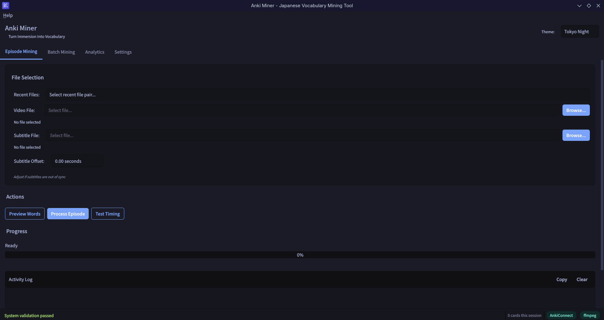
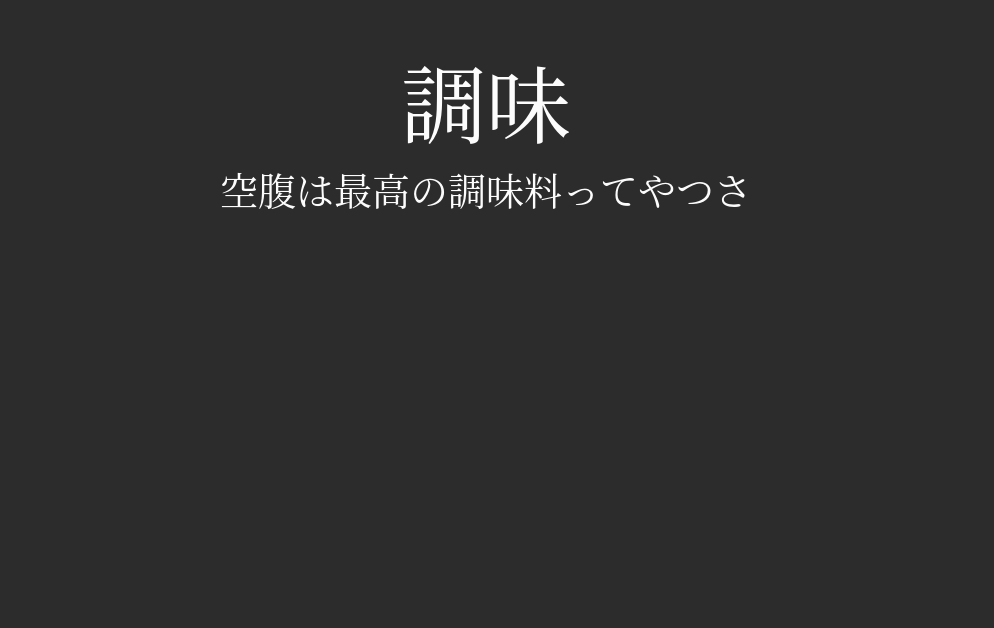
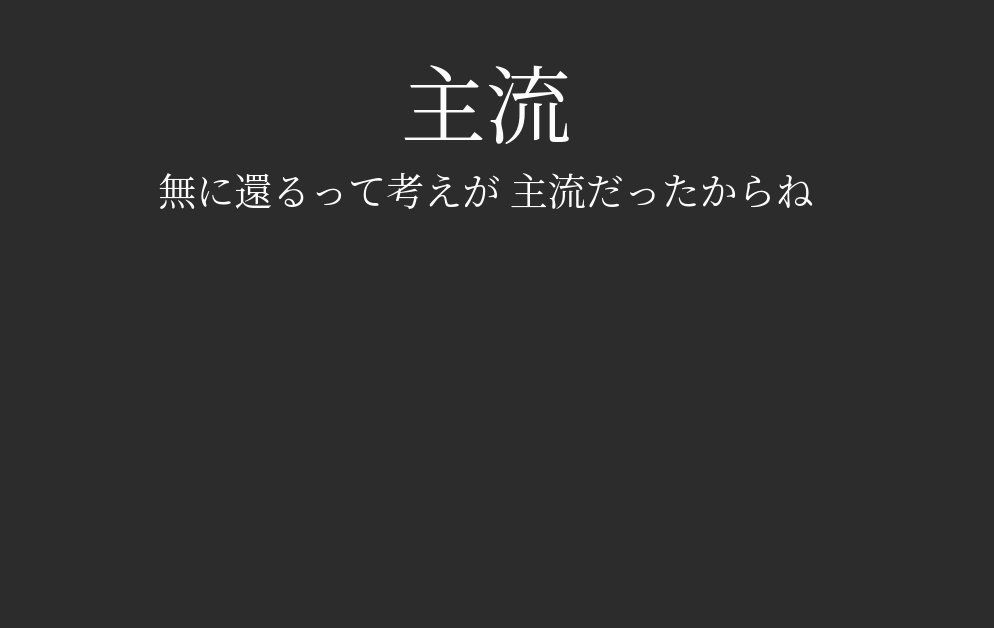
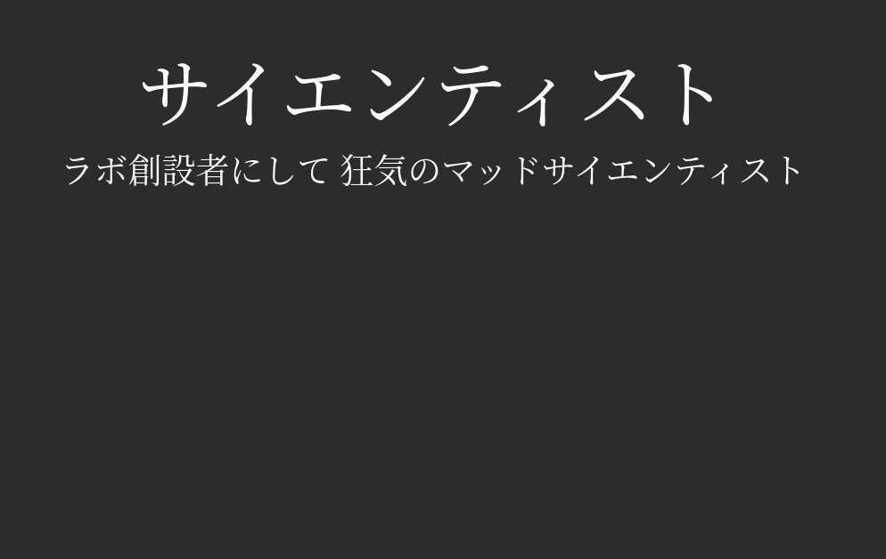

# Anki Miner

[](https://pypi.org/project/anki-miner/)
[](https://www.gnu.org/licenses/gpl-3.0)
[](https://www.python.org/downloads/)

Batch-mines Japanese vocabulary from anime and YouTube into Anki cards. Given a season folder or a YouTube URL, it produces cards containing screenshots, sentence audio, furigana, pitch accent, and frequency data.

Suited to batch processing after viewing, rather than real-time lookup during playback (the asbplayer and Yomitan workflow).

## Showcase



### Example cards

| | | |
|---|---|---|
|  |  |  |

*Generated from video and subtitle files. Each card contains a screenshot, sentence audio, furigana, and definition.*

## How It Works

1. **Parse subtitles**: tokenize Japanese text with MeCab morphological analysis.
2. **Filter words**: keep content words (nouns, verbs, adjectives, adverbs); drop words already in your Anki collection or on your blacklist.
3. **Extract media**: capture screenshots and audio clips from the video at each subtitle's timestamp via ffmpeg.
4. **Fetch definitions**: look up definitions through your configured dictionary chain (Yomitan-format dictionaries, with Jisho as optional online fallback).
5. **Create cards**: batch upload to Anki via AnkiConnect.

## Features

- Lapis-compatible cards with furigana, pitch accent, and word frequency fields.
- YouTube support: paste a URL, mine the video.
- Queue a folder of episode/subtitle pairs for sequential processing.
- Pluggable dictionary chain: load any Yomitan-format dictionaries, reorder freely, with Jisho online as optional fallback.
- Preview and curate the word list before any cards are created.
- Parallel ffmpeg extraction for screenshots and sentence audio.
- Analytics dashboard with history, undo, and series difficulty rankings.
- Four themes (Light, Dark, Sakura, Tokyo Night) plus custom JSON themes.

## Installation

### Requirements

- **ffmpeg** on PATH.
  - macOS: `brew install ffmpeg`
  - Ubuntu/Debian: `sudo apt install ffmpeg`
  - Windows: [download from ffmpeg.org](https://ffmpeg.org/download.html) and add to PATH.
- **Anki** with the [AnkiConnect](https://ankiweb.net/shared/info/2055492159) add-on. In Anki: **Tools → Add-ons → Get Add-ons**, paste code `2055492159`, restart.

### Download

Grab the installer for your platform from the [latest release](https://github.com/0xzerolight/anki_miner/releases/latest):

| Platform | Installer | Portable |
|----------|-----------|----------|
| Windows | `AnkiMiner-*-Setup.exe` | `AnkiMiner-Windows-x86_64.zip` |
| Linux (Debian/Ubuntu) | `anki-miner_*_amd64.deb` | `AnkiMiner-*-Linux-x86_64.AppImage` |
| Linux (other) | — | `AnkiMiner-Linux-x86_64.tar.gz` |
| macOS (Apple Silicon) | — | `AnkiMiner-macOS-arm64.tar.gz` |

No Python required. Installers and portable archives bundle all dependencies.

<details>
<summary><strong>Install from PyPI (Python 3.10+)</strong></summary>

```bash
pipx install anki-miner   # or: pip install anki-miner
```

</details>

<details>
<summary><strong>Install from source</strong></summary>

```bash
git clone https://github.com/0xzerolight/anki_miner.git
cd anki_miner
pip install .
```

</details>

## Quick Start

After installing, launch **Anki Miner** from your Start Menu, Applications folder, or app menu. If you installed from PyPI or source, run `anki_miner_gui` from a terminal. A desktop shortcut is created on first launch; re-run it from **Tools -> Create Desktop Shortcut...** inside the app.

Anki must be running with AnkiConnect installed before mining starts.

Tabs:
- **Single Episode**: mine one video/subtitle pair with file selectors and progress tracking.
- **Batch Processing**: queue multiple series for sequential processing.
- **YouTube**: paste a URL, fetch metadata, then mine.
- **Analytics**: history, series difficulty, milestones.
- **Settings**: Anki connection, media extraction, dictionary, word filtering. Saved to `~/.anki_miner/gui_config.json`.

## Recommended Setup

### Lapis Note Type

Anki Miner uses the [Lapis](https://github.com/donkuri/lapis) note type fields by default. For custom note types, rename the fields in Settings/Anki.

1. Download the latest `.apkg` from [Lapis releases](https://github.com/donkuri/lapis/releases).
2. In Anki: **File → Import** and select the `.apkg`.

Default field mapping:

| Anki Miner Field       | Note Field          | Content                       |
|------------------------|---------------------|-------------------------------|
| word                   | Expression          | Dictionary form of the word   |
| sentence               | Sentence            | Original subtitle line        |
| definition             | MainDefinition      | English definitions           |
| picture                | Picture             | Screenshot from the video     |
| audio                  | SentenceAudio       | Audio clip of the sentence    |
| expression_furigana    | ExpressionFurigana  | Word with furigana reading    |
| sentence_furigana      | SentenceFurigana    | Sentence with furigana reading|
| pitch_position         | *(unmapped)*        | Pitch accent position number  |
| pitch_category         | *(unmapped)*        | Pitch accent category         |
| frequency              | *(unmapped)*        | Word frequency rank           |

Fields marked *(unmapped)* have no default Lapis mapping. Map them in Settings if your note type has equivalents. Any note type with the required fields works.

### Dictionaries

Anki Miner looks up definitions through a **provider chain** you configure. Each lookup tries the providers in order; the first hit wins. Mix any number of offline Yomitan-format dictionaries with the Jisho online fallback, in any order.

Add a dictionary in **Settings → Add Dictionary…** by pointing at a Yomitan `.zip` archive. Drag entries to reorder the chain. Installed dictionaries are indexed once into `~/.anki_miner/dicts/<dict_id>/index.sqlite` and loaded on startup. Structured-content entries are rendered to HTML on import, so card definitions preserve the source dictionary's formatting (definition lists, examples, tags).

**Recommended Japanese → English dictionary**: [Jitendex](https://github.com/Jitendex/Jitendex) — a modern JMdict successor with richer formatting, examples, and tags. Download the latest Yomitan archive from the [Jitendex releases page](https://github.com/Jitendex/Jitendex/releases) and add it via Settings.

Without any local dictionary, lookups fall back to the Jisho API (slower, online, rate-limited).

> Upgrading from a pre-multi-dictionary release? A legacy `~/.anki_miner/JMdict_e` file is auto-migrated to the new SQLite index on first launch. The legacy XML can be deleted after migration.

## YouTube Mining

Paste a URL, click **Fetch Info** to probe metadata (title, duration, subtitle availability), then click **Mine**. The fetch downloads the video and its Japanese subtitle track into a per-run temporary directory, then passes both files to the same pipeline used for file-based mining.

Auto-captions are accepted only when native Japanese. Tracks that YouTube generates by machine-translating from English are rejected, since mining them yields unusable results. Native auto-captions remain lower quality than manual subtitles because they lack sentence boundaries.

Gotchas:

- **Bot-detection prompts**: if YouTube asks "Sign in to confirm you're not a bot", open **Settings -> Cookies -> Browser** and pick Firefox or Chrome. yt-dlp pulls cookies from that browser's profile on every fetch.
- **Age-restricted videos**: same fix.
- **Max duration**: defaults to 120 minutes. The probe aborts before downloading if the video is longer. Adjust in Settings.

## Updates

Anki Miner checks GitHub for new releases on startup (toggle in Settings). When an update is available, a banner offers a one-click download of the asset that matches your install: `.deb` for Debian/Ubuntu, `.AppImage` for AppImage, the Inno installer on Windows, the macOS arm64 archive, or the release page for pip/source installs. "Skip this version" suppresses the prompt for that release; the next release prompts again.

## Troubleshooting

| Issue                    | Solution                                                                         |
|--------------------------|----------------------------------------------------------------------------------|
| "Cannot connect to Anki" | Start Anki and ensure AnkiConnect is installed.                                  |
| "Deck not found"         | Create the deck in Anki or update the deck name in Settings.                     |
| "Note type not found"    | Import Lapis (see above) or configure your own in Settings.                      |
| "ffmpeg not found"       | Install ffmpeg and add it to PATH.                                               |
| No definitions found     | Add a Yomitan dictionary in Settings → Add Dictionary…, or enable the Jisho fallback. |
| Audio is wrong language  | The tool tries Japanese audio tracks first, then falls back to the default.     |
| Subtitles out of sync    | Use the subtitle offset control in the GUI.                                      |

## Issues, Feature Ideas, Contributing

Report bugs in [Issues](https://github.com/0xzerolight/anki_miner/issues).

See [CONTRIBUTING.md](CONTRIBUTING.md) for development setup.

New feature ideas in [Discussions](https://github.com/0xzerolight/anki_miner/discussions).

## License

GNU General Public License v3.0. See [LICENSE](LICENSE).
